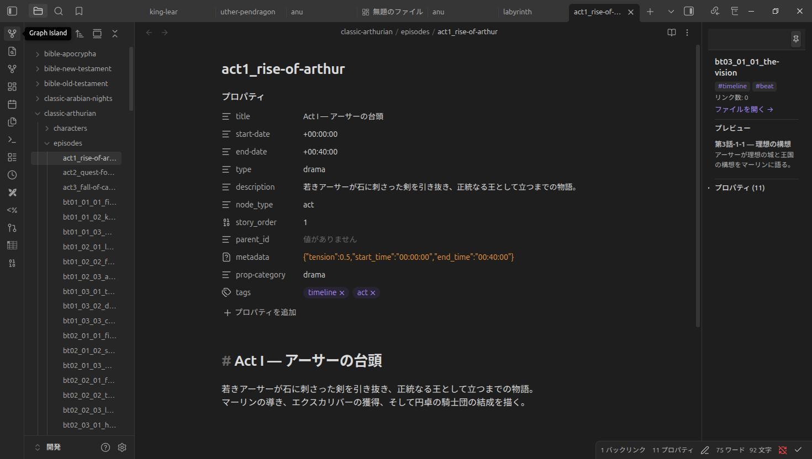
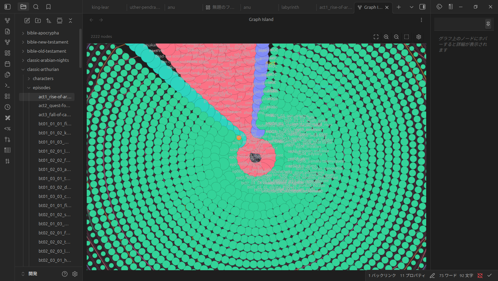
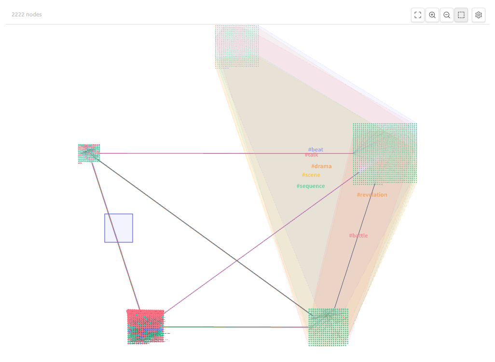
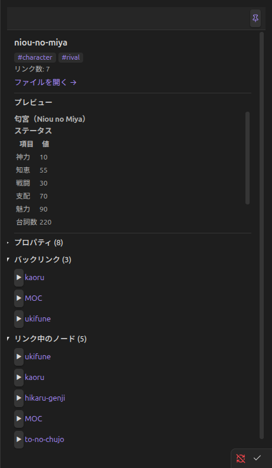
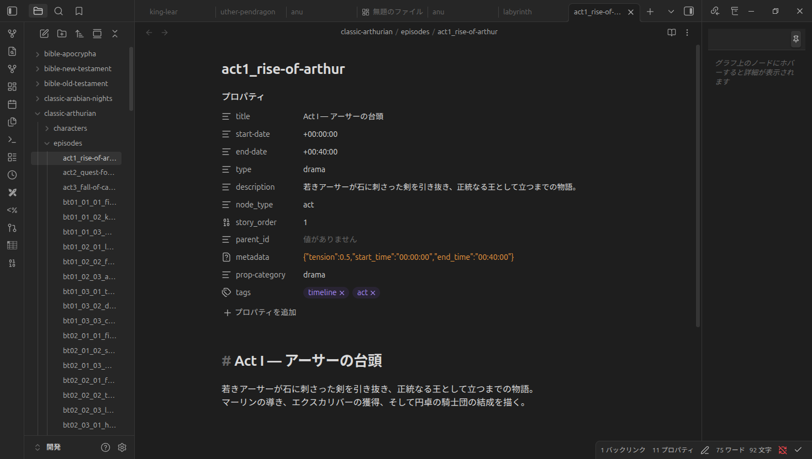

# Graph Island

**Multiple graph visualization layouts for Obsidian**

Graph Island replaces and extends Obsidian's built-in graph view with rich layout options, metadata-driven coloring, tag-based enclosures, cluster arrangements, and a detailed node inspector panel.



## Features

### Multiple Layouts

| Layout | Description |
|--------|-------------|
| **Force** | Physics-based simulation with customizable gravity, node rules, and edge bundling |
| **Concentric** | Nodes arranged in concentric shells by degree, category, or custom sort |
| **Tree** | Hierarchical tree layout grouped by category |
| **Arc** | Arc/radial arrangement sorted by degree or label |
| **Sunburst** | Hierarchical pie chart based on tag or folder structure |

### Cluster Arrangements

When cluster mode is enabled, nodes are first grouped (by tag, backlink count, or node type), then each cluster is arranged using one of **8 patterns**:

| Pattern | Description |
|---------|-------------|
| Grid | Even grid layout |
| Tree | Hierarchical tree within each cluster |
| Spiral | Archimedean spiral |
| Concentric | Concentric rings within each cluster |
| Sunburst | Radial sector layout |
| Triangle | Triangular packing |
| Mountain | Mountain/peak arrangement |
| Random | Random scatter |

Multi-level grouping is supported — e.g., first group by tag, then subdivide by connected components.



### Enclosure Display

Tag groups can be visualized as **convex hull enclosures** — smooth boundaries that wrap around all nodes sharing the same tag. Enclosure labels appear on hover.

- Minimum-ratio threshold to hide small groups
- Zoomed-out mode fills enclosures with translucent color for overview
- Zoomed-in mode shows stroke-only outlines



### Node Detail Panel

A dedicated side panel shows detailed information for hovered or pinned nodes:

- Tag badges, link count
- One-click file open
- Inline preview (rendered markdown)
- Properties table (frontmatter)
- Backlinks & outgoing links with expand/collapse



### Edge Types & Rendering

Graph Island recognizes multiple edge types derived from your vault:

- **Links** — standard `[[wikilinks]]` and markdown links
- **Tags** — shared tag connections
- **Categories** — shared frontmatter category
- **Semantic** — ontology-based edges (inheritance, aggregation, similarity)

Edges are color-coded by type and support **edge bundling** for cleaner visualization at any zoom level.

### Ontology System

Define semantic relationships between notes:

- **Inheritance** (is-a): `parent`, `extends`, `up` fields
- **Aggregation** (has-a): `contains`, `parts`, `has` fields
- **Similarity**: `similar`, `related` fields
- **Tag Hierarchy**: Nested tags (`#entity/character`) auto-generate inheritance edges
- **Custom Mappings**: Map arbitrary field names to ontology types

### Query-Based Color Groups

Define conditional color groups using a boolean query language:

```json
[{
  "condition": { "layout": "force" },
  "groups": [
    { "expression": { "type": "leaf", "field": "tag", "value": "character" }, "color": "#ff6b6b" },
    { "expression": { "type": "leaf", "field": "tag", "value": "location" }, "color": "#4ecdc4" }
  ]
}]
```

Supports `AND`, `OR`, `NOT` operators and fields: `tag`, `category`, `path`, `node_type`, `backlinks`.

### Node Rules

Per-node spacing and gravity control via query filters:

```json
[{ "query": "tag:character", "spacingMultiplier": 2.0, "gravityAngle": 270, "gravityStrength": 0.1 }]
```

### Directional Gravity

Push groups of nodes toward specific directions:

```json
[{ "filter": "tag:character", "direction": "top", "strength": 0.1 }]
```

### Interactive Controls

- **Toolbar**: Fit-all, zoom in/out, marquee select, settings toggle
- **Hover highlighting**: Configurable hop-depth for neighborhood highlighting
- **Hold/pin**: Pin node detail panel to keep it visible
- **Shell rotation**: Concentric shells rotate on click (clockwise/counter-clockwise)

### Settings Management

- **JSON import/export**: Share settings as `.json` files
- **Vault-based storage**: Export settings to a vault path
- **All-in-panel UI**: Every setting is adjustable from the side panel — no need to leave the graph
- **Sample configs** included in `examples/`



### i18n

Fully localized for **English** and **Japanese**. The UI language follows Obsidian's locale setting automatically.

## Installation

### From Source

```bash
git clone https://github.com/laximgqozaZZZYT/obsidian-graph-island.git
cd obsidian-graph-island
npm install
npm run build
```

Copy `main.js`, `manifest.json`, and `styles.css` to your vault's `.obsidian/plugins/graph-island/` directory.

### Usage

1. Enable the plugin in **Settings → Community Plugins**
2. Open the command palette and run **Graph Island: Open Graph View**
3. Use the gear icon (top-right) to configure layout, colors, and display options

## Configuration

All settings can be configured through:

1. **Side panel UI** — directly in the graph view
2. **JSON file** — import/export via Settings tab
3. **Sample configs** — see `examples/` directory for pre-built configurations

### Example: Novel Writing Setup

```json
{
  "metadataFields": ["tags", "category", "characters", "locations"],
  "colorField": "category",
  "groupField": "category",
  "ontology": {
    "inheritanceFields": ["parent", "extends"],
    "aggregationFields": ["contains", "parts"],
    "similarFields": ["similar", "related"],
    "useTagHierarchy": true
  }
}
```

## Development

```bash
npm run dev       # Watch mode (auto-rebuild)
npm run build     # Production build
npm run test      # Run vitest unit tests
```

### Architecture

```
src/
├── main.ts                    # Plugin entry point
├── types.ts                   # Type definitions & defaults
├── i18n.ts                    # Internationalization (en/ja)
├── settings.ts                # Settings tab (JSON import/export)
├── utils/
│   ├── geometry.ts            # Convex hull, capsule geometry
│   ├── graph-helpers.ts       # Graph data utilities
│   └── query-expr.ts          # Boolean query expression engine
└── views/
    ├── GraphViewContainer.ts  # Main view (PIXI.js canvas, force sim)
    ├── PanelBuilder.ts        # Side panel UI builder
    ├── EdgeRenderer.ts        # Edge drawing & bundling
    ├── EnclosureRenderer.ts   # Tag enclosure convex hulls
    └── NodeDetailView.ts      # Node inspector panel
```

### Tests

65 unit tests across 6 test files covering:

- Edge rendering logic
- Enclosure hull computation
- Geometry utilities (convex hull, capsule)
- Graph helper functions
- Query expression evaluation

## Requirements

- Obsidian 1.0.0+
- Desktop and mobile supported

## License

MIT
