# Graph Island

**Advanced graph visualization for Obsidian** &mdash; Force layouts, cable-tray wiring, 4 view modes, and 60+ sample presets.

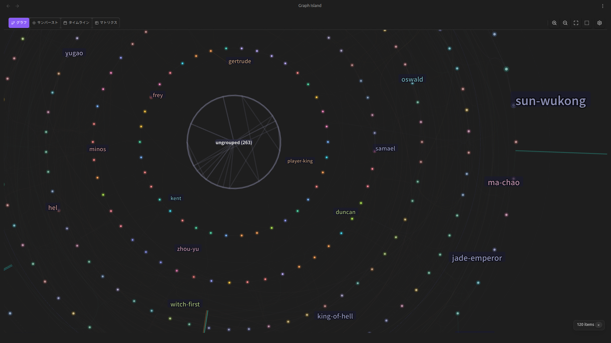

Graph Island replaces Obsidian's built-in graph view with a feature-rich canvas that supports metadata-driven coloring, tag enclosures, cable-tray edge bundling, multiple layout algorithms, and a configurable settings panel &mdash; all within the graph view itself.

## View Modes

Switch between four visualization modes using the tab bar at the top of the graph view.

### Graph

Force-directed layout with customizable physics (repulsion, link distance, center force). Nodes are colored by category, tag, or folder. Edges are routed through cable-tray conduits when cluster grouping is active.

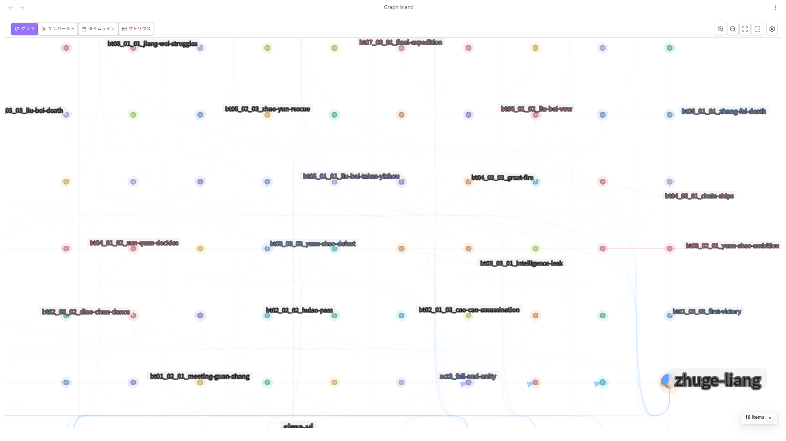

### Sunburst

Hierarchical pie chart showing folder or tag structure. Click a sector to filter the graph by that category. Hover for group stats.

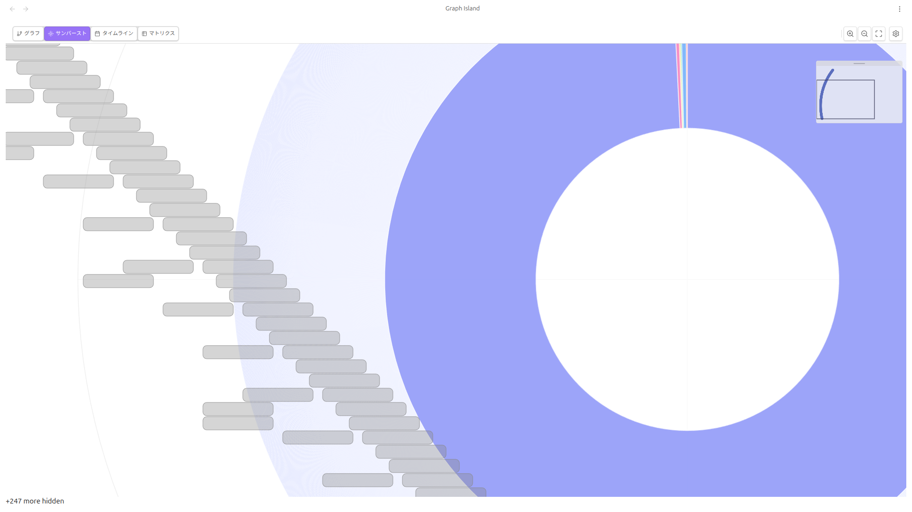

### Timeline

Nodes arranged chronologically by a frontmatter date field (`start-date`, `date`, etc.). Duration bars show event spans. Sequence edges connect related events.

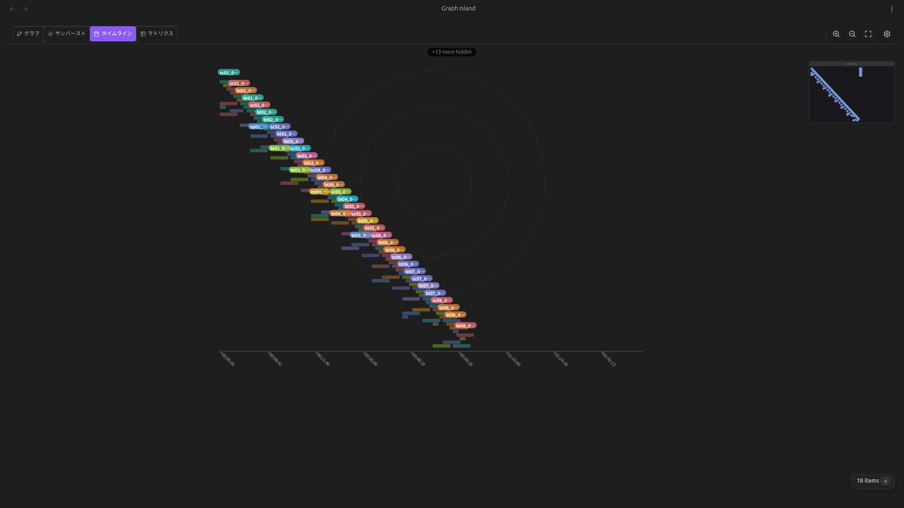

### Matrix

Adjacency matrix showing all connections between nodes. Sort by degree, label, or category. Hover a cell to see edge type breakdown.

## Features

### Cluster Arrangements

When `groupBy` is set (folder, tag, category, or Louvain community), nodes are grouped and each cluster is arranged using one of 8 patterns:

| Pattern | Description |
|---------|-------------|
| Grid | Even grid layout |
| Concentric | Concentric rings by degree |
| Tree | Hierarchical tree |
| Spiral | Archimedean spiral |
| Sunburst | Radial sectors |
| Triangle | Triangular packing |
| Mountain | Peak arrangement |
| Custom | Coordinate-system based (polar/cartesian) |

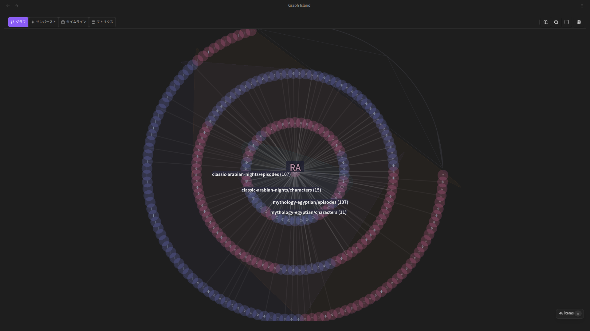

### Cable-Tray Edge Bundling

Edges between clusters are routed through shared conduits (trunks), with individual wires color-coded by edge type. Intra-group edges use junction-grid Manhattan routing. This replaces the visual noise of crossing lines with organized wiring.

- **Trunks**: Inter-group conduits with color-separated cables
- **Wires**: Individual edge paths with perpendicular offset
- **Port routing**: Automatic entry/exit point selection per cluster
- Configurable bundling threshold via `trunkMinEdges`

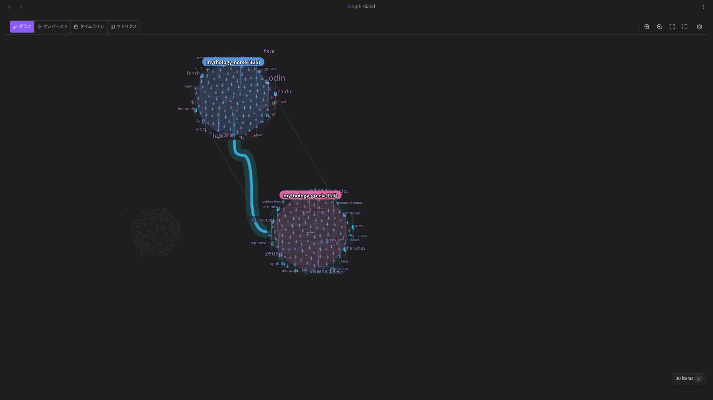

### Enclosure Display

Tag groups rendered as convex hull boundaries. Enclosure labels appear at group centroids with zoom-adaptive crossfade.

### Node Display

| Mode | Description |
|------|-------------|
| Circle/Shape | LOD-based labels with halo, leader lines, collision avoidance |
| Card | Metadata table with frontmatter fields and body preview |

### Edge Types

| Type | Source | Default Color |
|------|--------|---------------|
| Link | `[[wikilinks]]` | Blue |
| Tag | Shared tags | Cyan |
| Semantic | Ontology fields (parent, contains, similar) | Orange |
| Has-tag | Node-to-tag connection | Gray |

### Ontology System

Define semantic relationships via frontmatter fields:

- **Inheritance**: `parent`, `extends`, `up`
- **Aggregation**: `contains`, `parts`, `has`
- **Similarity**: `similar`, `related`
- **Sequence**: `next`, `prev`, `story_order`
- **Tag Hierarchy**: `#entity/character` auto-generates inheritance edges

### Search Query Language

Filter nodes with boolean expressions:

```
path:mythology-greek* OR tag:deity
node_type:character AND NOT path:classic-hamlet*
hop:zeus:2
```

Supports `AND`, `OR`, `NOT`, `XOR`, `NOR`, `NAND`, wildcards (`*`), and fuzzy matching (`~`).

### Interactive Controls

| Action | Description |
|--------|-------------|
| Hover | Highlight N-hop neighborhood, show linked node labels |
| Click + drag | Move nodes |
| Scroll | Zoom in/out |
| Fit All button | Zoom to show all nodes |
| Group label click | Zoom into that cluster |
| Alt+Click | Pathfinder start/end |
| Shift+Click | Multi-select |
| Ctrl+Click | Side-by-side comparison |
| Tab | Cycle through nodes (keyboard navigation) |

### Zoom-Adaptive Rendering

Nodes, labels, and intra-group cables fade out at extreme zoom-out levels, while inter-group trunks and group labels remain visible. This prevents visual clutter when viewing large graphs at overview zoom.

| Zoom | Nodes | Labels | Edges |
|------|-------|--------|-------|
| < 0.15 | Near-invisible | Hidden | Trunks only |
| 0.15 - 0.5 | Fading | Group labels only | Trunks + fading cables |
| > 0.5 | Full | All visible | Full |

### GPU Animation Gating

When the WebGL backend is available (`IApp.supportsAnimation = true`), zoom/pan/layout transitions are smoothly animated. On Canvas2D fallback, animations are skipped for performance &mdash; views jump directly to the target state.

### Settings Panel

All settings configurable from the in-view side panel:

- Layout parameters (force physics, node size, spacing)
- Display toggles (edges, labels, minimap, legend)
- Color mode (category, folder, tag)
- Preset selector with 60+ sample configurations
- JSON import/export
- Search across all settings

### i18n

English and Japanese. Follows Obsidian's locale setting.

### Mobile Support

Lightweight rendering mode on mobile: node cap (200), label cap (50), LOD floor, tap-to-hover.

## Quick Start

### Installation

**From source:**

```bash
git clone https://github.com/laximgqozaZZZYT/obsidian-graph-island.git
cd obsidian-graph-island
npm install
npm run build
```

Copy `main.js`, `manifest.json`, and `styles.css` to `.obsidian/plugins/graph-island/` in your vault.

### First Use

1. Enable **Graph Island** in Settings > Community Plugins
2. Run **Graph Island: Open Graph View** from the command palette
3. Click the gear icon to open the settings panel
4. Try a sample preset from the **Sample Presets** dropdown

## Sample Gallery

128 sample screenshots are available in [`docs/screenshots/`](docs/screenshots/). Each screenshot has a corresponding `.json` file with the exact settings used.

<details>
<summary>View sample screenshots</summary>

| Preview | Preset |
|---------|--------|
| 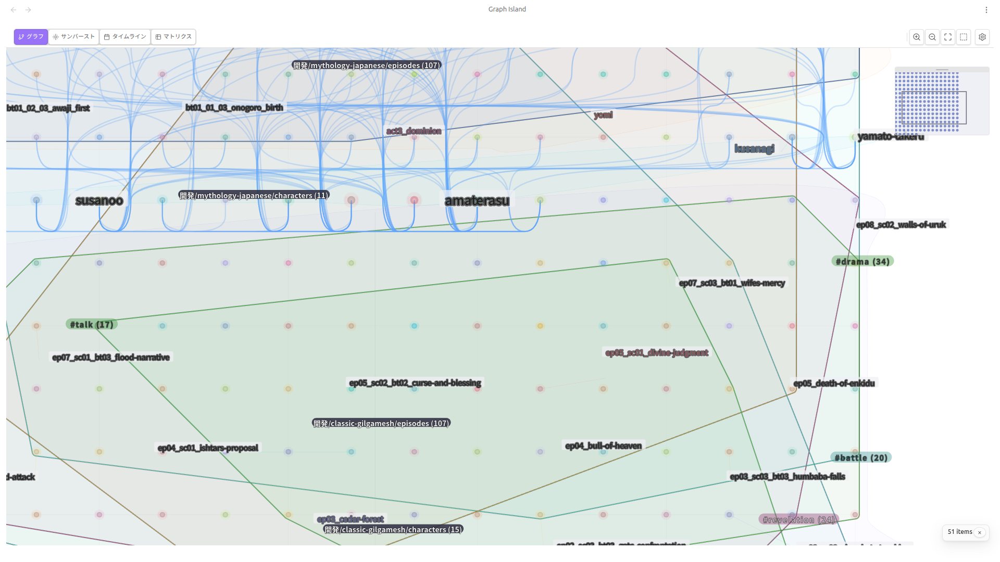 | Panorama Overview |
|  | Dense Cluster (zoomed) |
| 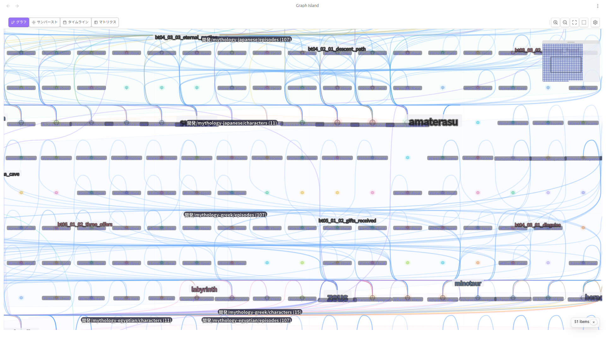 | Mythology Pantheon |
|  | Sangokushi Factions (zoomed) |
| 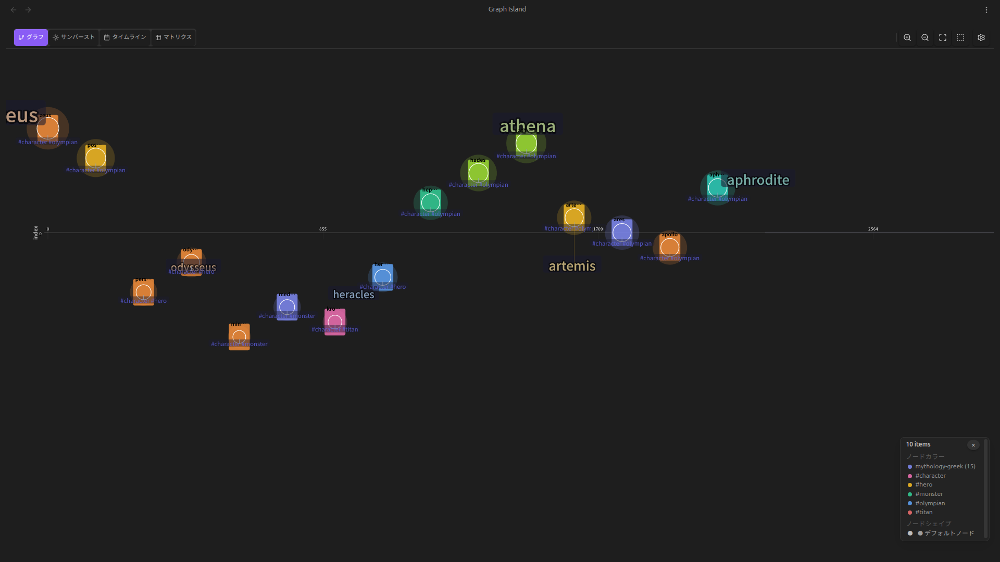 | Minimalist |
| 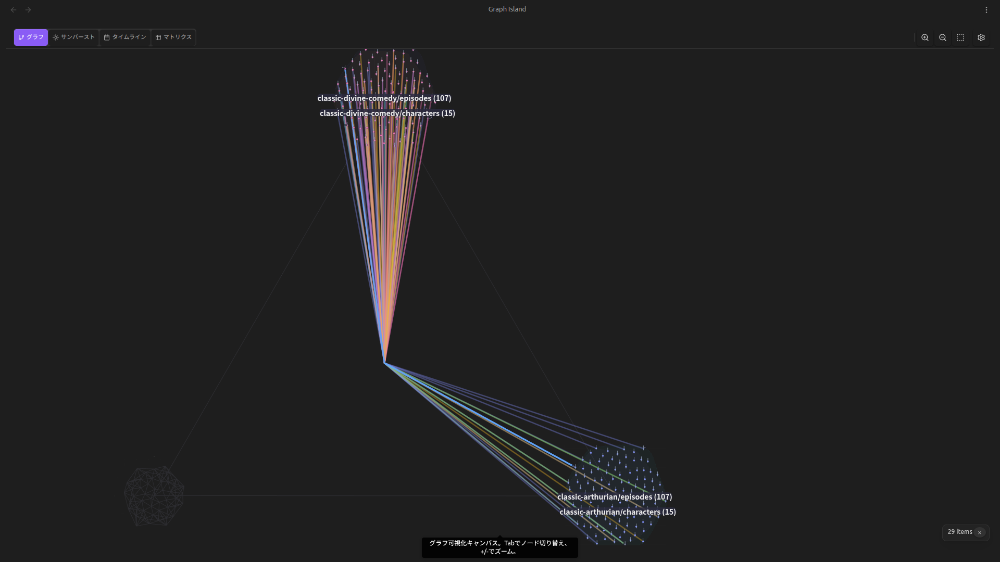 | Edge Bundle Art |
| 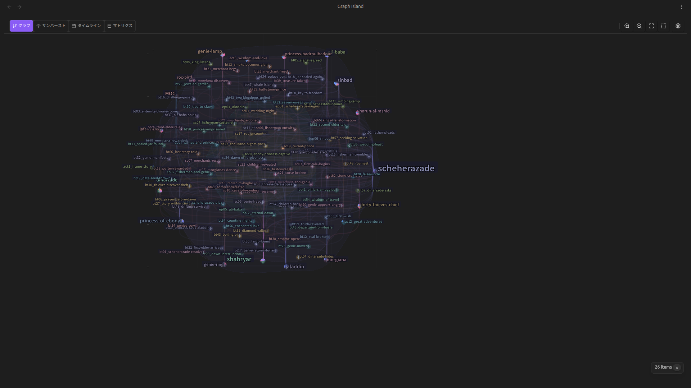 | Arabian Nights |
| 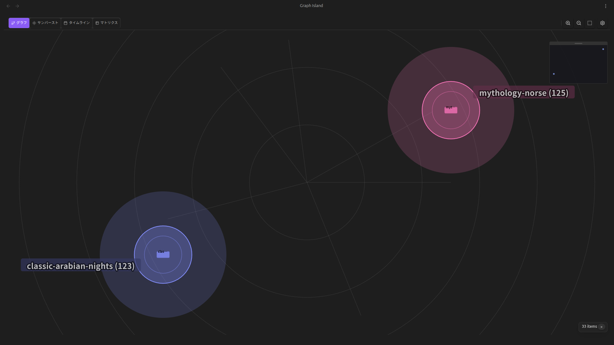 | Concentric by Degree |
| 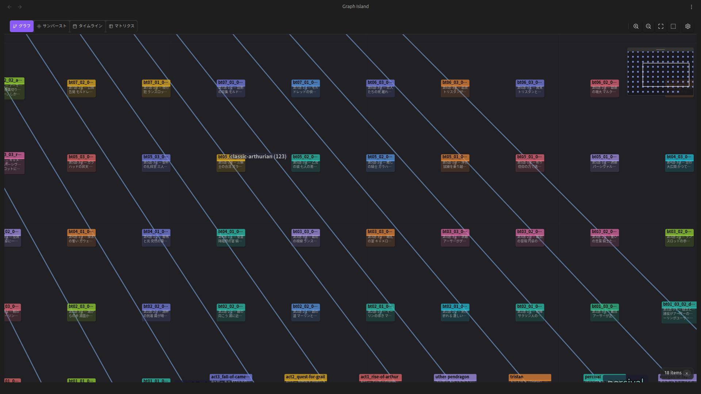 | ER Diagram (zoomed) |
| 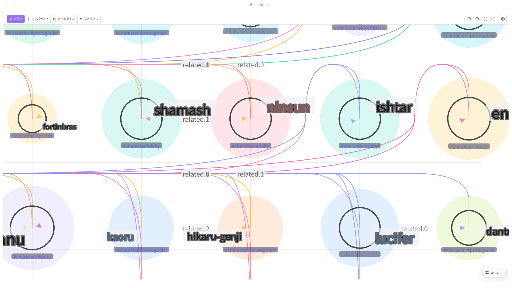 | Category Search Filtered (zoomed) |
|  | Timeline Arthurian |
| 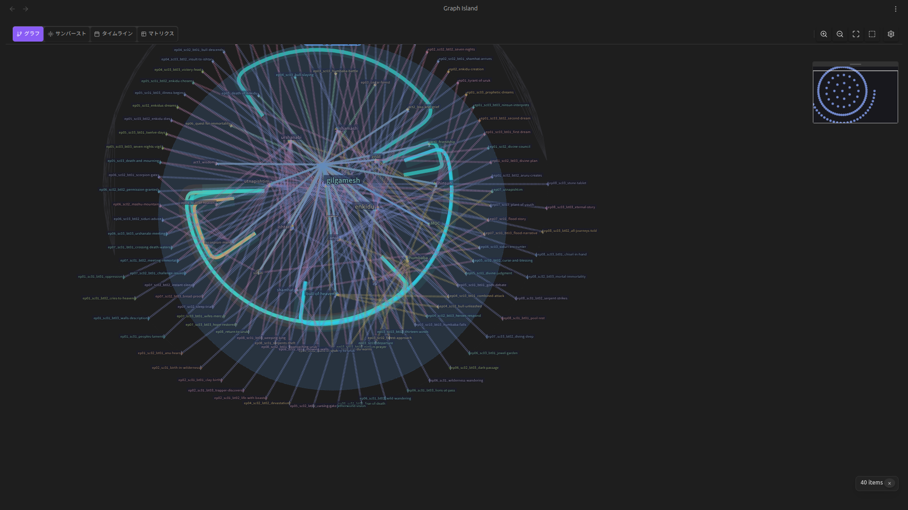 | Radial Gilgamesh |

</details>

## Development

```bash
npm run dev       # Watch mode
npm run build     # Production build
npm run test      # Unit tests (vitest)
```

### Test Coverage

- **2987+ unit tests** across 111 test files
- Coverage thresholds enforced: Statements 29.7%, Branches 27.9%, Functions 27.7%, Lines 29.4%
- E2E tests via CDP (Chrome DevTools Protocol) against live Obsidian

### Architecture

```
src/
├── main.ts                     # Plugin entry
├── types.ts                    # Types, defaults, ontology
├── i18n.ts                     # EN/JA localization
├── settings.ts                 # Settings tab
├── constants.ts                # Edge types, layout constants
├── utils/
│   ├── graph-helpers.ts        # BFS, adjacency, auto-fit, filtering
│   ├── query-expr.ts           # Boolean query parser
│   ├── geometry.ts             # Convex hull, spatial grid
│   ├── color.ts                # WCAG contrast, HSL
│   └── export-png.ts           # PNG/SVG export
├── parsers/
│   └── metadata-parser.ts      # Vault → GraphData pipeline
├── layouts/
│   ├── cluster-force.ts        # d3-force + cluster arrangements
│   ├── cable-tray.ts           # Road network for edge routing
│   └── coordinate-engine.ts    # Polar/cartesian coordinate system
└── views/
    ├── GraphViewContainer.ts   # Main orchestrator (Canvas2D)
    ├── RenderPipeline.ts       # Frame rendering, LOD, label culling
    ├── EdgeRenderer.ts         # Cable-tray wiring, trunk routing
    ├── InteractionManager.ts   # Pointer, zoom, marquee, lasso
    ├── LabelManager.ts         # Label placement, collision avoidance
    ├── EnclosureRenderer.ts    # Tag enclosure hulls
    ├── PanelBuilder.ts         # Settings panel UI
    ├── LayoutTransition.ts     # Smooth position animation
    ├── canvas2d/               # Canvas2D backend (IApp, IContainer, IGraphics)
    ├── webgl/                  # WebGL2 backend (dual-canvas)
    └── renderer-factory.ts     # Backend detection + factory
```

## License

MIT
